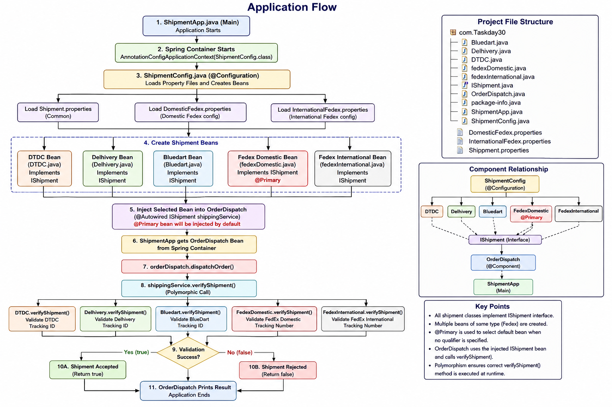

# Shipment Management System (Spring Core)

A Java application built using **Spring Core** that demonstrates Dependency Injection (DI), Java-based Configuration, Interface-based Programming, and Property File Management. The application validates shipment details for different courier partners using polymorphism.

---

## Features

- Spring Core Java Configuration (`@Configuration`, `@Bean`)
- Dependency Injection using `@Autowired`
- Multiple Shipment Providers
- `@Primary` Bean Selection
- Interface-based Programming
- External Configuration using `.properties`
- Shipment Validation Logic
- Clean Object-Oriented Design

---

## Technologies Used

- Java
- Spring Core
- Maven
- Eclipse IDE

---

## Project Structure

```
Shipment-Management-System
│
├── src
│   ├── ShipmentApp.java
│   ├── ShipmentConfig.java
│   ├── OrderDispatch.java
│   ├── IShipment.java
│   ├── DTDC.java
│   ├── Delhivery.java
│   ├── BlueDart.java
│   ├── FedexDomestic.java
│   ├── FedexInternational.java
│
├── resources
│   ├── Shipment.properties
│   ├── DomesticFedex.properties
│   └── InternationalFedex.properties
│
├── pom.xml
└── README.md
```

---

## Supported Courier Services

| Courier | Validation |
|----------|------------|
| DTDC | Tracking ID Validation |
| Delhivery | Tracking Code Validation |
| BlueDart | Tracking Code Validation |
| FedEx Domestic | Vendor Code + Tracking Number |
| FedEx International | Vendor Code + Tracking Number |

---

## Spring Concepts Demonstrated

- Dependency Injection
- Bean Creation
- Java Configuration
- `@Autowired`
- `@Bean`
- `@Configuration`
- `@Primary`
- `@PropertySource`
- Environment API
- Polymorphism
- Interface-based Design

---

## Application Flow

```
ShipmentApp
      │
      ▼
Spring Container
      │
      ▼
ShipmentConfig
      │
      ▼
Load Property Files
      │
      ▼
Create Shipment Beans
      │
      ▼
Inject Selected Bean
      │
      ▼
OrderDispatch
      │
      ▼
verifyShipment()
      │
      ▼
Validation Result
```

> You can replace the above diagram with your generated application flow image.

Example:

```markdown

```

---

## How to Run

1. Clone the repository

```bash
git clone https://github.com/Im-Mortal-Lal/spring-core-shipment-management.git
```

2. Open the project in Eclipse.

3. Update Maven dependencies.

4. Run

```
ShipmentApp.java
```

---

## Learning Outcomes

This project helped me understand:

- Spring Dependency Injection
- Bean Lifecycle
- Java-based Configuration
- External Configuration using Properties Files
- Interface-driven Development
- Polymorphism in Spring Applications

---

## Future Improvements

- Convert to Spring Boot
- Build REST APIs
- Connect to MySQL
- Add Logging
- Add Unit Testing (JUnit)
- Swagger/OpenAPI Documentation

---

## Author

**Koturu Lalit**

GitHub: https://github.com/Im-Mortal-Lal
